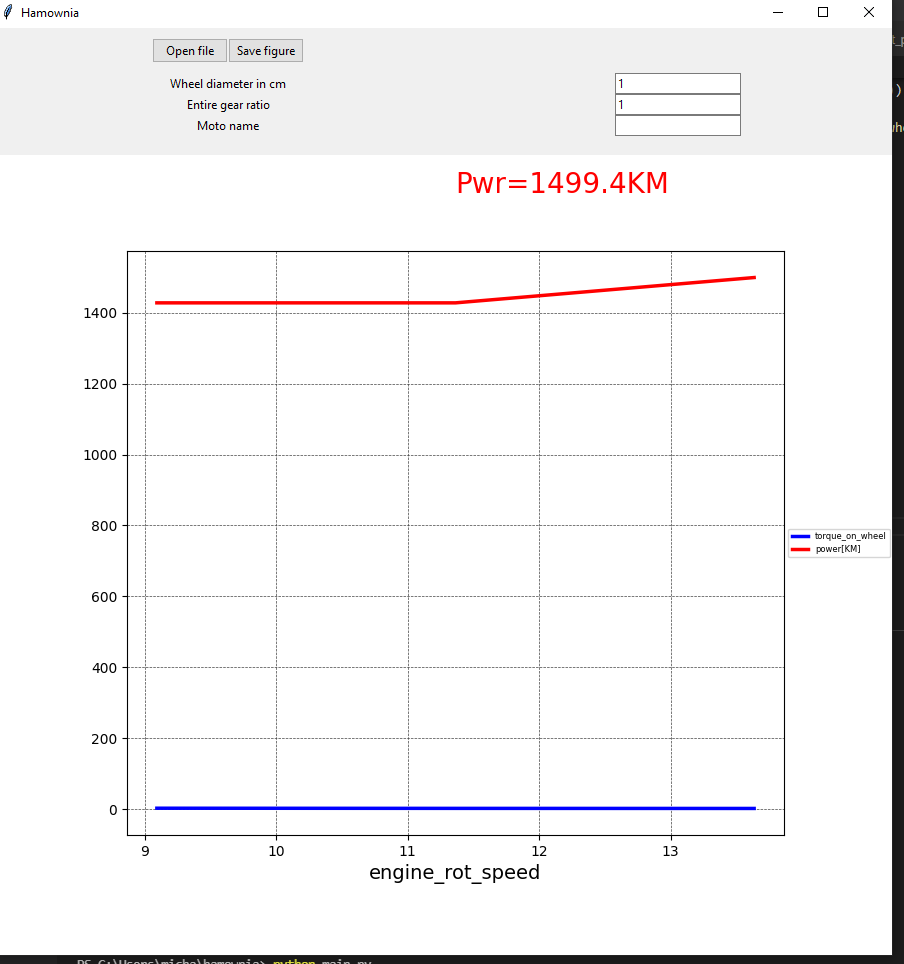

# requirements 
python 3.10.2

# building 
```
pip install -r requirements.txt
pip install pyinstaller==4.8
cd building
pyinstaller --onefile --windowed main.py
```

good to check that file is virus free by: https://www.virustotal.com/

# run tests
py.test



