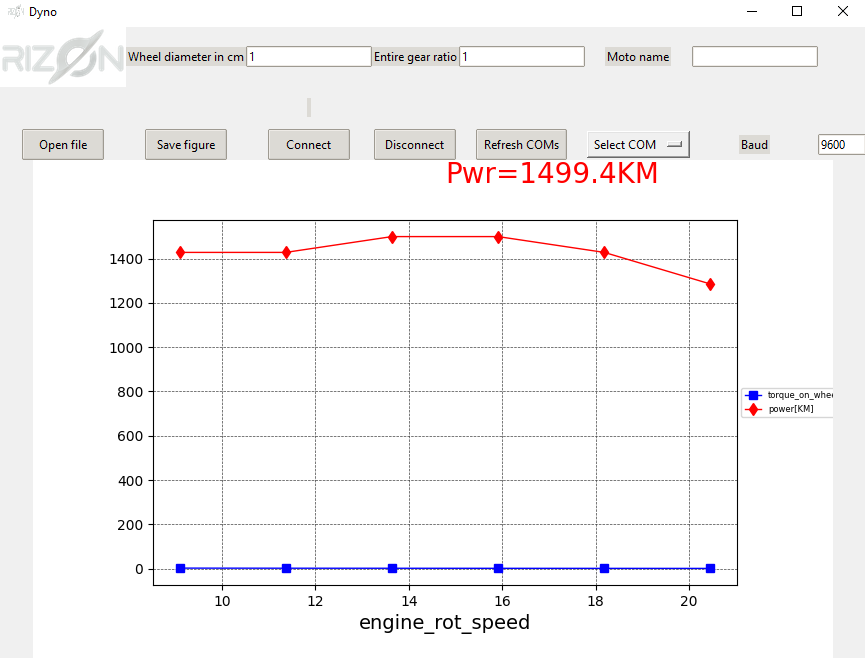

# requirements
python 3.10.2
pip install -r requirements.txt
pip install pywin32==303

# building
```
pip install -r requirements.txt
pip install pyinstaller==4.8
cd building
pyinstaller --onefile --windowed main.py
```

but best to have pyinstaller builded from scratch to have less viruses detected

good to check that file is virus free by: https://www.virustotal.com/

# run tests




# run
python main.py
